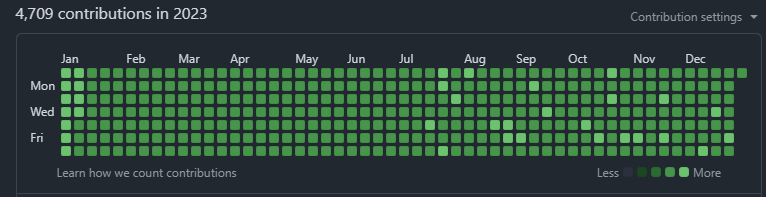

# GitBot de Contribuições

Um bot em Node.js que automaticamente cria commits “back‑dated” para colorir o seu contribution graph no GitHub.  
Ele oferece dois modos de operação:

1. **Commits aleatórios** espalhados ao longo de um período.  
2. **Commit diário** garantido para cada dia entre duas datas.

---

## 📂 Estrutura do Projeto

```text
.
├─ contribuition.png   # Exemplo de gráfico de contribuições
├─ data.json           # Arquivo que é sobrescrito a cada commit
├─ index.js            # Gera N commits em datas aleatórias
├─ everyday.js         # Gera um commit para cada dia em um intervalo
├─ package.json
└─ README.md
```

---

## 🔧 Requisitos

- Node.js ≥ 14  
- Git configurado (com `origin` apontando para o repositório remoto)  

---

## ⚙️ Instalação

1. Clone o repositório:
   ```bash
   git clone https://github.com/seu-usuario/gitbot-contribuicoes.git
   cd gitbot-contribuicoes
   ```
2. Instale as dependências:
   ```bash
   npm install simple-git moment jsonfile random
   ```

---

## 🚀 Uso

### 1) Commits Aleatórios (`index.js`)

Gera **N** commits em datas sorteadas aleatoriamente dentro de um intervalo retroativo.

```js
// index.js
import jsonfile from "jsonfile";
import moment from "moment";
import simpleGit from "simple-git";
import random from "random";

const path = "./data.json";

const makeCommits = (n) => {
  if (n === 0) return simpleGit().push();

  // sorteia x semanas e y dias
  const x = random.int(0, 150); // ajustar total de semanas
  const y = random.int(0, 6);

  // calcula data a partir de hoje menos 3 anos + offset
  const date = moment()
    .subtract(3, "years")
    .add(1, "day")
    .add(x, "weeks")
    .add(y, "days")
    .format();

  jsonfile.writeFile(path, { date }, () => {
    simpleGit()
      .add([path])
      .commit(date, { "--date": date }, () => makeCommits(n - 1));
  });

  console.log("→ Commit criado em:", date);
};

// Exemplo: gera 1000 commits aleatórios
makeCommits(1000);
```

**Como executar:**
```bash
node index.js
```

---

### 2) Commit Diário (`everyday.js`)

Gera **um commit para cada dia** entre uma data de início e fim.

```js
// everyday.js
import jsonfile from "jsonfile";
import moment from "moment";
import simpleGit from "simple-git";

const path = "./data.json";
const git = simpleGit(process.cwd());

async function commitEveryDay() {
  // detecta remote e branch atuais
  const remotes = await git.getRemotes(true);
  const origin = remotes.find(r => r.name === "origin")?.name || "origin";
  const branch = (await git.branch()).current;

  console.log(`Remote: ${origin}`);
  console.log(`Branch: ${branch}`);

  // define intervalo
  const startDate = moment("2022-01-01", "YYYY-MM-DD");
  const endDate   = moment("2025-07-17", "YYYY-MM-DD");

  // loop diário
  for (
    let m = startDate.clone();
    m.isSameOrBefore(endDate, "day");
    m.add(1, "day")
  ) {
    const date = m.format();
    await jsonfile.writeFile(path, { date }, { spaces: 0 });
    await git.add(path);
    await git.commit(date, { "--date": date });
    console.log(`✅ Commit para ${date}`);
  }

  // push final
  await git.push(origin, branch);
  console.log(`🚀 Todos os commits empurrados para ${origin}/${branch}!`);
}

commitEveryDay();
```

**Como executar:**
```bash
node everyday.js
```

---

## 🔄 Personalização

- **Intervalo de datas**: modifique as variáveis `startDate` e `endDate` em `everyday.js`.  
- **Quantidade de commits**: altere o argumento de `makeCommits(N)` em `index.js`.  
- **Offset aleatório**: ajuste os limites de `random.int(...)` para variar a distribuição.

---

## ⚠️ Atenção

- Tenha certeza de que seu repositório remoto (`origin`) esteja corretamente configurado e que você tenha permissão de push.  
- Esse bot **altera o histórico Git**: use com cuidado em repositórios onde o histórico compartilhado é importante.

---

## 📄 Licença

Este projeto está sob a [MIT License](LICENSE).  
